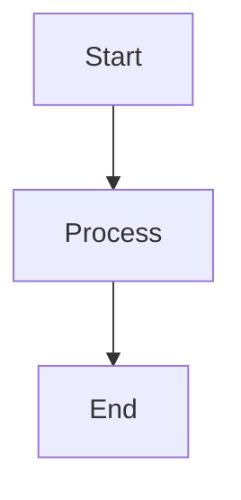

# RealEstate API Documentation

This directory contains the complete documentation for the RealEstate API, built with [Docusaurus](https://docusaurus.io/).

## Quick Start

### Prerequisites
- Node.js 16+ 
- npm or yarn

### Installation and Development

```bash
# Navigate to docs directory
cd docs

# Install dependencies
npm install

# Start development server
npm run start
```

The documentation site will be available at `http://localhost:3000`.

### Building for Production

```bash
# Build static site
npm run build

# Serve built site locally
npm run serve
```

## Documentation Structure

```
docs/
├── docs/                   # Documentation markdown files
│   ├── getting-started/    # Installation and setup guides
│   ├── development/        # Development guides
│   ├── api/               # API documentation
│   └── deployment/        # Deployment guides
├── blog/                  # Blog posts and updates
├── src/
│   ├── components/        # React components
│   ├── pages/            # Custom pages
│   │   ├── architecture/ # Architecture documentation
│   │   ├── api-reference/# Scalar API reference
│   │   ├── database/     # Database schema docs
│   │   └── adrs/         # Architecture Decision Records
│   └── css/              # Custom styles
├── static/               # Static assets
└── docusaurus.config.ts  # Docusaurus configuration
```

## Key Features

- 📚 **Comprehensive Documentation** - Complete guides and references
- 🎨 **Interactive Diagrams** - Mermaid integration for architecture diagrams
- 🔍 **API Reference** - Scalar-powered interactive API documentation
- 📊 **Database Schema** - Visual database documentation
- 📋 **ADRs** - Architecture Decision Records
- 🌙 **Dark Mode** - Built-in theme switching
- 📱 **Responsive** - Mobile-friendly design

## Available Scripts

```bash
npm run start          # Start development server
npm run build          # Build for production
npm run serve          # Serve built site
npm run clear          # Clear Docusaurus cache
npm run swizzle        # Eject and customize components
npm run deploy         # Deploy to GitHub Pages
```

## Updating Documentation

### Adding New Documentation

1. Create new markdown files in the appropriate `docs/` subdirectory
2. Update `sidebars.ts` to include new pages in navigation
3. Use frontmatter for metadata:

```markdown
---
id: my-doc
title: My Document
sidebar_label: My Doc
---

# My Document Content
```

### Adding Architecture Diagrams

Use Mermaid syntax for diagrams:

````markdown

````

### Adding API Documentation

Update the API Reference page at `src/pages/api-reference/index.tsx` to point to your OpenAPI specification.

## Deployment

### GitHub Pages

1. Configure GitHub Pages in repository settings
2. Update `docusaurus.config.ts` with correct `url` and `baseUrl`
3. Run deployment:

```bash
npm run deploy
```

### Other Hosting Platforms

Build the static site and deploy the `build/` directory to your hosting platform:

```bash
npm run build
# Deploy contents of build/ directory
```

## Contributing

1. Make changes in the appropriate documentation files
2. Test locally with `npm run start`
3. Build and verify with `npm run build`
4. Submit pull request

## Troubleshooting

### Common Issues

**Mermaid diagrams not rendering:**
- Ensure `@docusaurus/theme-mermaid` is installed
- Check Mermaid syntax is correct

**Build failures:**
- Clear cache: `npm run clear`
- Check for broken links or invalid markdown

**Styling issues:**
- Check `src/css/custom.css` for CSS conflicts
- Verify component imports are correct

## Support

For documentation issues:
1. Check existing issues in the repository
2. Search Docusaurus documentation
3. Create new issue with detailed description