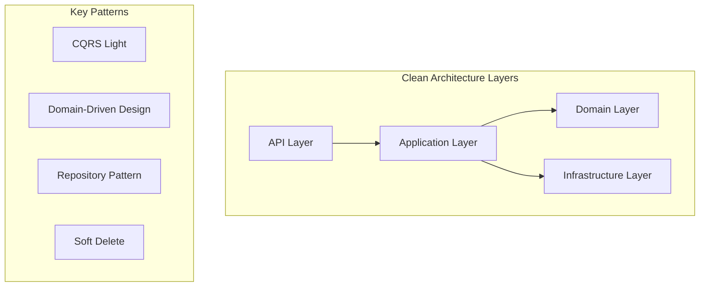

# Welcome to RealEstate API Documentation

We're excited to launch the comprehensive documentation for our RealEstate API! This documentation site provides everything you need to understand, implement, and contribute to our real estate management system.

<!-- truncate -->

## What's New

Our new documentation site includes:

- **🏗️ Architecture Documentation** - Deep dive into our Clean Architecture implementation
- **📚 API Reference** - Interactive API documentation powered by Scalar
- **📊 Database Schema** - Complete database documentation with ER diagrams
- **📋 ADRs** - Architecture Decision Records for transparency
- **🚀 Getting Started Guides** - Step-by-step setup and configuration

## Built with Modern Tools

This documentation is built with:

- **[Docusaurus](https://docusaurus.io/)** - Modern static site generator
- **[Mermaid](https://mermaid.js.org/)** - Beautiful diagrams and flowcharts  
- **[Scalar](https://scalar.com/)** - Interactive API reference
- **TypeScript** - Type-safe documentation code

## Architecture Highlights

Our RealEstate API showcases several modern architectural patterns:

### Key Features

- **Clean Architecture** with clear separation of concerns
- **Domain-Driven Design** with rich domain models
- **CQRS Light** pattern without event sourcing complexity
- **JWT Authentication** with custom implementation
- **Comprehensive Testing** with NUnit and FluentAssertions
- **Entity Framework Core** with Code-First approach

## What's Coming Next

We're continuously improving the documentation with:

- 📈 **SchemaSpy Integration** - Interactive database schema browser
- 🔄 **CI/CD Documentation** - Deployment and DevOps guides
- 📖 **More ADRs** - Document ongoing architectural decisions
- 🎯 **Performance Guides** - Optimization and monitoring documentation
- 🧪 **Testing Strategies** - Comprehensive testing documentation

## Contributing to Documentation

Found an error or want to improve something? Our documentation is open source and we welcome contributions:

1. Fork the repository
2. Make your changes in the `/docs` directory
3. Submit a pull request

## Get Started Today

Ready to explore? Here are some great starting points:

- [Installation Guide](/docs/getting-started/installation) - Set up your development environment
- [Architecture Overview](/architecture) - Understand the system design
- [API Reference](/api-reference) - Explore the endpoints
- [Database Schema](/database) - Review the data model

We're excited to see what you build with the RealEstate API! 🚀

---

*The RealEstate Team*