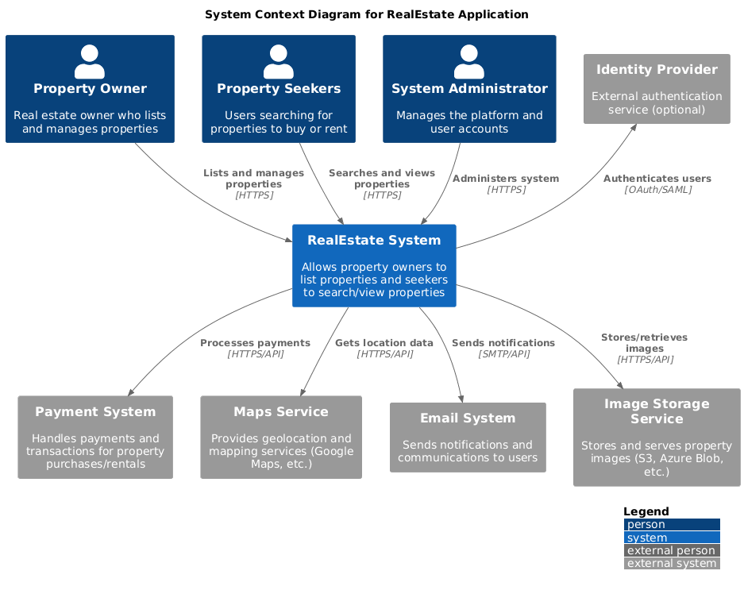
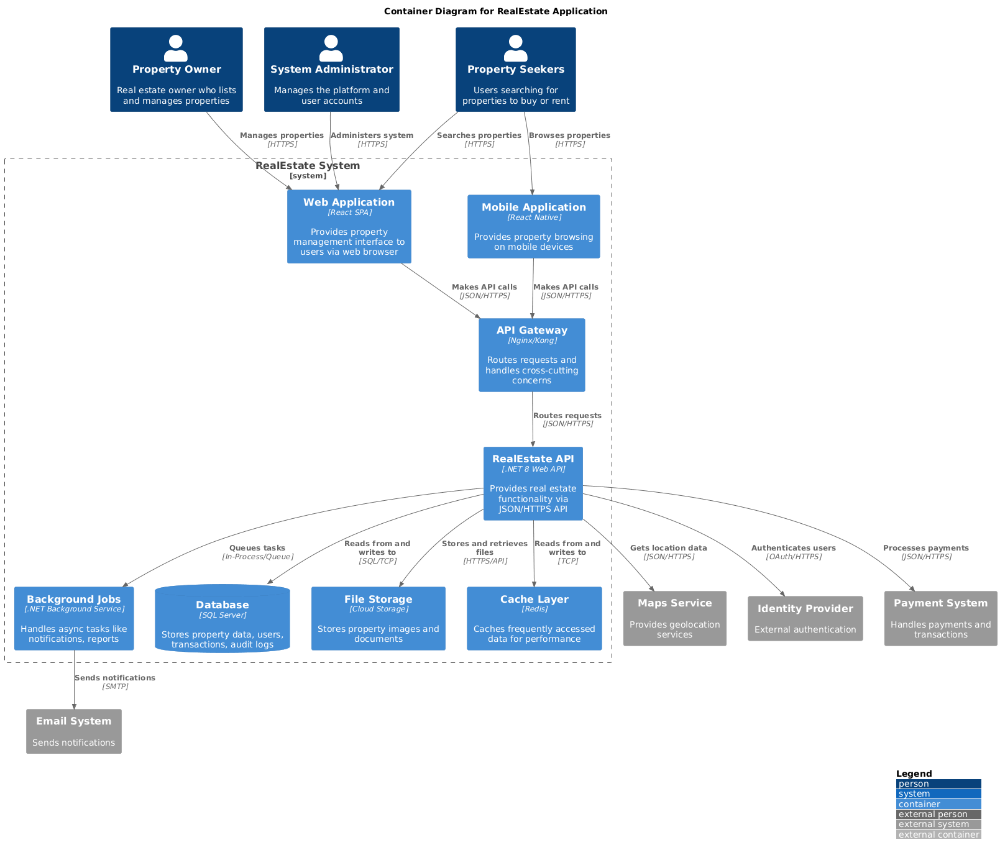
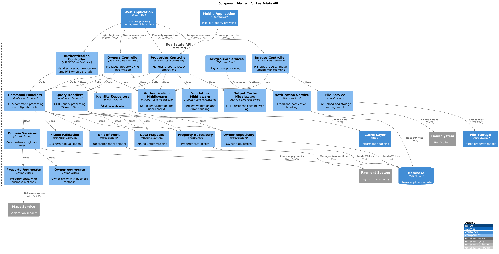
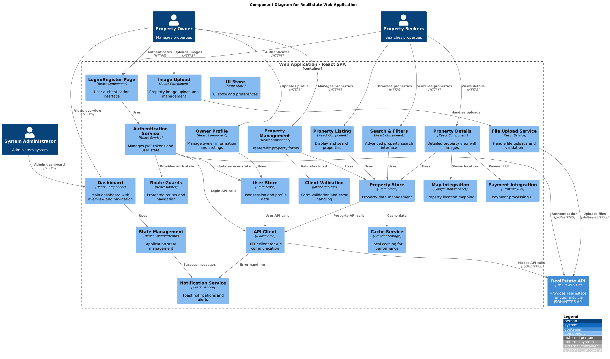
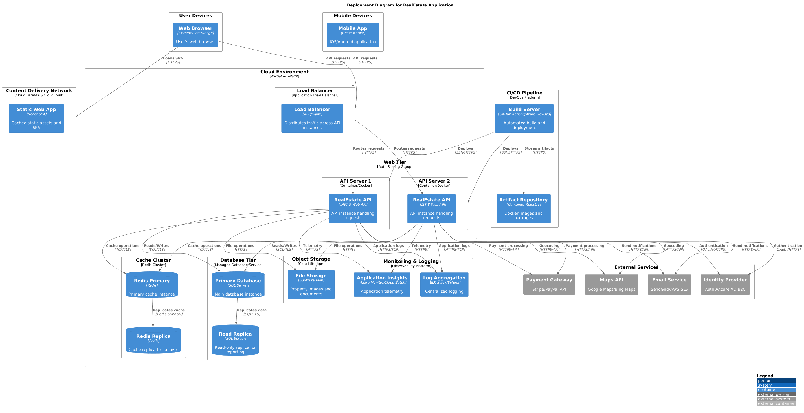

# C4 Architecture Diagrams

The C4 model provides a hierarchical approach to software architecture documentation, showing the system from different levels of detail. These diagrams use the C4 model notation to illustrate both the current RealEstate application implementation and planned future enhancements for scalability.

## Implementation Status

**Currently Implemented:**
- .NET 8 Web API with Clean Architecture
- Domain entities with business logic (Property, Owner, PropertyImage, PropertyTrace)
- CQRS light pattern with command/query handlers
- Entity Framework Core with SQL Server
- JWT authentication with ASP.NET Core Identity
- FluentValidation for input validation
- Unit testing infrastructure with NUnit

**Future Scalability Planning:**
- Frontend applications (React SPA, React Native mobile)
- Load balancing and auto-scaling infrastructure
- External service integrations (payment, email, maps)
- Advanced caching and performance optimizations
- Production deployment with monitoring and CI/CD

## About C4 Diagrams

The C4 model consists of four levels:
- **Level 1**: System Context - Shows how the system fits into the world
- **Level 2**: Container - Shows the high-level technology choices  
- **Level 3**: Component - Shows how containers are made up of components
- **Level 4**: Code - Shows how components are implemented (optional)

## System Context Diagram (Level 1)

Shows the RealEstate system and how it fits into the overall environment with external systems and users.

**Key Elements:**
- **RealEstate System**: The main software system being documented
- **Property Owners**: Users who manage and list properties
- **Property Seekers**: Users who search and view properties  
- **Administrators**: System administrators who manage the platform
- **External Systems**: Third-party integrations (payment, mapping, etc.)

**Current Implementation:**
- **RealEstate System**: The .NET 8 Web API currently implemented with Clean Architecture
- **Property Owners**: Authentication system supports user management (owners are managed as domain entities)
- **Administrators**: JWT-based authentication allows for admin roles

**Future Scalability Considerations:**
- **Property Seekers**: Public-facing web interface for property browsing
- **External Systems**: Payment processing, mapping services, email notifications, and cloud storage integrations

## Container Diagram (Level 2)

Shows the high-level technology choices and how responsibilities are distributed across containers.

**Containers:**
- **Web Application (SPA)**: Single Page Application for property management
- **API Gateway**: Entry point for all API requests
- **Real Estate API**: .NET 8 Web API with business logic
- **Database**: SQL Server database for persistent storage
- **File Storage**: Cloud storage for property images
- **Identity Provider**: Authentication and authorization service

**Currently Implemented:**
- **Real Estate API**: .NET 8 Web API with Clean Architecture, CQRS patterns, and JWT authentication
- **Database**: SQL Server with Entity Framework Core, soft delete patterns, and audit trails
- **Identity Provider**: ASP.NET Core Identity integrated within the API

**Future Scalability Considerations:**
- **Web Application (SPA)**: React-based single page application for property management
- **Mobile Application**: React Native app for mobile property browsing
- **API Gateway**: Load balancing and request routing (Nginx/Kong)
- **Cache Layer**: Redis for performance optimization
- **File Storage**: Cloud storage integration for property images and documents
- **Background Jobs**: Async task processing for notifications and reports

## Component Diagram (Level 3) - API Container

Shows the major components within the Real Estate API container and their interactions.

**API Components:**
- **Controllers**: HTTP request handlers (Properties, Owners, Auth)
- **Command Handlers**: CQRS command processing
- **Query Handlers**: CQRS query processing  
- **Domain Services**: Core business logic
- **Repositories**: Data access layer
- **Authentication Module**: JWT token handling
- **Validation Services**: FluentValidation integration

**Currently Implemented Components:**
- **Controllers**: ASP.NET Core controllers for Properties, Owners, and Authentication
- **Command Handlers**: CQRS light pattern for write operations (Create, Update, Delete)
- **Query Handlers**: CQRS light pattern for read operations (Search, Get)
- **Domain Services**: Core business logic in Property and Owner aggregates
- **Repositories**: Repository pattern with Entity Framework Core
- **Authentication Module**: JWT token generation and validation
- **Validation Services**: FluentValidation with automatic registration
- **Unit of Work**: Transaction management for data consistency
- **Domain Entities**: Rich domain models (Property, Owner, PropertyImage, PropertyTrace)

**Future Enhancement Considerations:**
- **Background Services**: Async task processing for notifications and reports
- **File Service**: Advanced file upload and management capabilities
- **Advanced Caching**: Redis integration for improved performance
- **External Service Integrations**: Payment processing, email notifications, and mapping services

## Component Diagram (Level 3) - Web Application

Shows the major components within the Web Application container.

**Web Application Components:**
- **Property Management**: Property listing and editing features
- **Search & Browse**: Property search and filtering
- **User Management**: Owner and user profile management
- **Authentication**: Login and authorization flows
- **API Client**: HTTP client for backend communication
- **State Management**: Application state handling

**Note:** *This diagram represents the planned architecture for a future frontend application. Currently, the system only includes the backend API.*

**Planned Web Application Components:**
- **Property Management**: React components for listing and editing properties
- **Search & Browse**: Property search and filtering interface
- **User Management**: Owner and user profile management pages
- **Authentication**: Login and authorization flows
- **API Client**: HTTP client (Axios/Fetch) for backend communication
- **State Management**: React Context or Redux for application state
- **Route Guards**: Protected routes and navigation
- **Client Validation**: Form validation and error handling
- **File Upload Service**: Property image upload capabilities
- **Map Integration**: Property location visualization
- **Payment Integration**: Payment processing UI components

## Deployment Diagram

Shows how the containers are deployed to infrastructure.

**Deployment Environment:**
- **Production Environment**: Cloud-hosted production deployment
- **Development Environment**: Local development setup
- **CI/CD Pipeline**: Automated build and deployment
- **Monitoring & Logging**: Application performance monitoring

**Note:** *This diagram represents the target production deployment architecture for future scaling. Currently, the system runs in development mode.*

**Current Development Environment:**
- **Local Development**: .NET 8 API running locally with SQL Server LocalDB
- **Basic Testing**: Unit tests with NUnit and integration testing capabilities

**Future Production Architecture:**
- **Load Balancing**: Application Load Balancer for distributing traffic
- **Auto Scaling**: Multiple API instances for handling increased load
- **Database Replication**: Primary database with read replicas for performance
- **Cache Cluster**: Redis cluster for high-performance caching
- **Cloud Storage**: Object storage for property images and documents
- **CI/CD Pipeline**: Automated build, test, and deployment workflows
- **Monitoring & Logging**: Application insights, centralized logging, and observability
- **Content Delivery Network**: Global content distribution for static assets