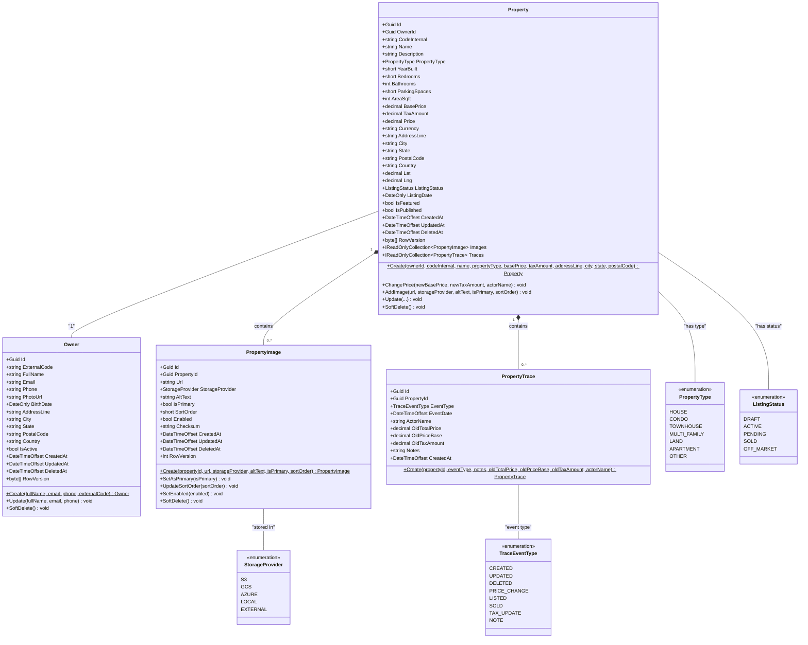

# Domain Entities - Class Diagram

This class diagram shows the core domain entities and their relationships in the RealEstate application. The entities follow Domain-Driven Design principles with private setters, factory methods, and rich domain behavior.

## Domain Model Overview

## Key Design Patterns

### Domain-Driven Design (DDD)
- **Aggregate Roots**: `Property` and `Owner` are aggregate roots that ensure consistency boundaries
- **Value Objects**: Enums represent value objects that provide type safety
- **Domain Services**: Business logic is encapsulated within the entities themselves

### Rich Domain Model
- **Private Setters**: All properties have private setters to maintain invariants
- **Factory Methods**: Static `Create()` methods ensure proper entity initialization
- **Domain Methods**: Methods like `ChangePrice()`, `AddImage()`, and `Update()` contain business logic
- **Collections**: Exposed as `IReadOnlyCollection<T>` to prevent external manipulation

### Audit and Soft Delete Pattern
- **Soft Delete**: All entities support soft delete via `DeletedAt` timestamp
- **Audit Trail**: `CreatedAt`, `UpdatedAt`, and `RowVersion` fields track changes
- **Property Trace**: Dedicated audit trail for property changes with detailed history

### Relationships
- **Property-Owner**: One-to-many relationship (Owner can have multiple Properties)
- **Property-PropertyImage**: One-to-many with business rules for primary images
- **Property-PropertyTrace**: One-to-many audit trail with automatic trace creation
- **Enum Dependencies**: Entities reference enums for type safety and consistency

## Business Rules Enforced

1. **Property Creation**: Requires valid owner, positive prices, and proper address information
2. **Price Changes**: Automatically creates audit trail entries with old/new price information
3. **Primary Images**: Only one primary image per property, automatically managed
4. **Soft Deletes**: Entities are never physically deleted, only marked as deleted
5. **Concurrency**: Row versions prevent concurrent update conflicts