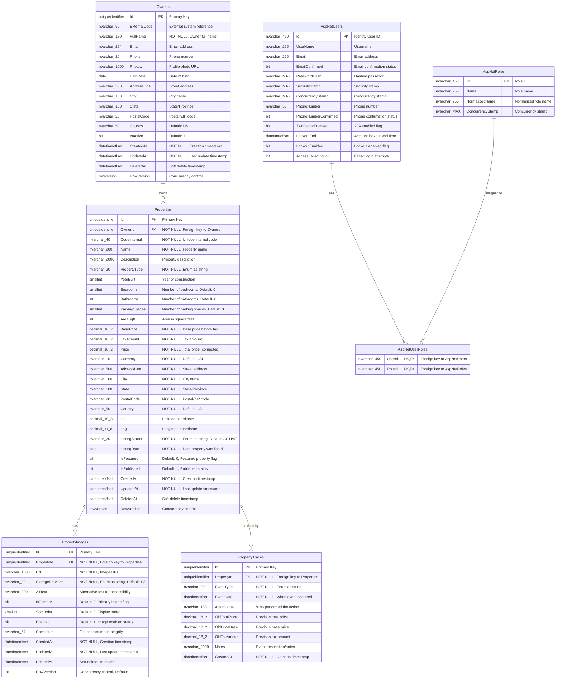

# Entity-Relationship Diagram

This document shows the database schema and relationships for the RealEstate application. The schema follows Domain-Driven Design principles with proper normalization and audit trail support.

## Database Schema Overview



## Key Database Features

### Relationships and Constraints

#### Primary Relationships
- **Owners → Properties**: One-to-Many (One owner can have multiple properties)
- **Properties → PropertyImages**: One-to-Many (One property can have multiple images)
- **Properties → PropertyTraces**: One-to-Many (One property has multiple audit trail entries)

#### Foreign Key Constraints
- `Properties.OwnerId` → `Owners.Id` (NOT NULL, with cascade rules)
- `PropertyImages.PropertyId` → `Properties.Id` (NOT NULL, cascade delete)
- `PropertyTraces.PropertyId` → `Properties.Id` (NOT NULL, cascade delete)

### Indexing Strategy

```sql
-- Primary Keys (Clustered Indexes)
PK_Owners (Id)
PK_Properties (Id)
PK_PropertyImages (Id)
PK_PropertyTraces (Id)

-- Foreign Key Indexes
IX_Properties_OwnerId (OwnerId)
IX_PropertyImages_PropertyId (PropertyId)
IX_PropertyTraces_PropertyId (PropertyId)

-- Business Logic Indexes
IX_Properties_CodeInternal (CodeInternal) -- UNIQUE
IX_Properties_ListingStatus_IsPublished (ListingStatus, IsPublished)
IX_Properties_City_State (City, State)
IX_PropertyImages_PropertyId_IsPrimary (PropertyId, IsPrimary)
IX_PropertyTraces_PropertyId_EventDate (PropertyId, EventDate DESC)

-- Soft Delete Support
IX_Owners_DeletedAt (DeletedAt) -- For filtering active records
IX_Properties_DeletedAt (DeletedAt) -- For filtering active records
IX_PropertyImages_DeletedAt (DeletedAt) -- For filtering active records
```

### Data Types and Constraints

#### Precision Specifications
- **Decimal Fields**: `decimal(18,2)` for monetary values ensuring precision
- **Geographic Coordinates**: `decimal(10,8)` for latitude, `decimal(11,8)` for longitude
- **Unicode Support**: `nvarchar` for all text fields supporting international characters

#### Business Rule Constraints
```sql
-- Price constraints
CHECK (BasePrice >= 0)
CHECK (TaxAmount >= 0)
CHECK (Price = BasePrice + TaxAmount)

-- Enum constraints
CHECK (PropertyType IN ('HOUSE', 'CONDO', 'TOWNHOUSE', 'MULTI_FAMILY', 'LAND', 'APARTMENT', 'OTHER'))
CHECK (ListingStatus IN ('DRAFT', 'ACTIVE', 'PENDING', 'SOLD', 'OFF_MARKET'))
CHECK (StorageProvider IN ('S3', 'GCS', 'AZURE', 'LOCAL', 'EXTERNAL'))
CHECK (EventType IN ('CREATED', 'UPDATED', 'DELETED', 'PRICE_CHANGE', 'LISTED', 'SOLD', 'TAX_UPDATE', 'NOTE'))

-- Coordinate constraints
CHECK (Lat >= -90 AND Lat <= 90)
CHECK (Lng >= -180 AND Lng <= 180)

-- Image constraints
CHECK (SortOrder >= 0)
```

### Audit Trail Design

#### Soft Delete Pattern
All main entities support soft delete:
- `DeletedAt` timestamp field (NULL = active, NOT NULL = deleted)
- Global query filters automatically exclude deleted records
- Audit trail preserved even after soft deletion

#### Concurrency Control
- **Properties/Owners**: `rowversion` (SQL Server timestamp) for optimistic concurrency
- **PropertyImages**: `int RowVersion` manually incremented
- **PropertyTraces**: Immutable records (no concurrency control needed)

#### Audit Trail Features
- **Automatic Tracking**: Created via domain events during entity operations
- **Price History**: Detailed tracking of price changes with old/new values
- **Actor Tracking**: Optional actor name for identifying who made changes
- **Event Types**: Comprehensive event type enumeration for different operations

### Performance Optimizations

#### Query Patterns
- **Active Records**: Global query filters for soft delete (WHERE DeletedAt IS NULL)
- **Property Listing**: Composite indexes on status and publication flags
- **Geographic Queries**: Spatial indexes on Lat/Lng for location-based searches
- **Image Loading**: Primary image queries optimized with specific indexing

#### Caching Strategy
- **Output Caching**: ETag-based caching for GET operations
- **Query Result Caching**: Distributed caching for expensive aggregations
- **Connection Pooling**: Optimized connection management for high throughput

### Security Considerations

#### Identity Integration
- **ASP.NET Core Identity**: Full integration with user management
- **Role-Based Access**: Support for role-based authorization
- **JWT Authentication**: Stateless authentication for API access

#### Data Protection
- **No PII in Traces**: Sensitive data excluded from audit trails
- **Encrypted Connections**: All database connections use SSL/TLS
- **Parameter Queries**: Protection against SQL injection attacks