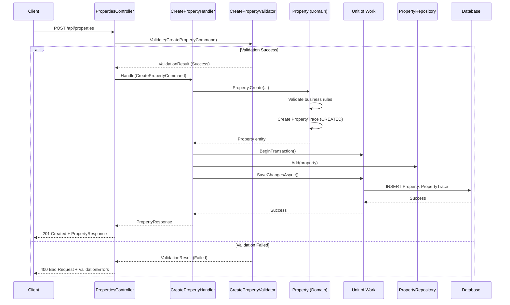
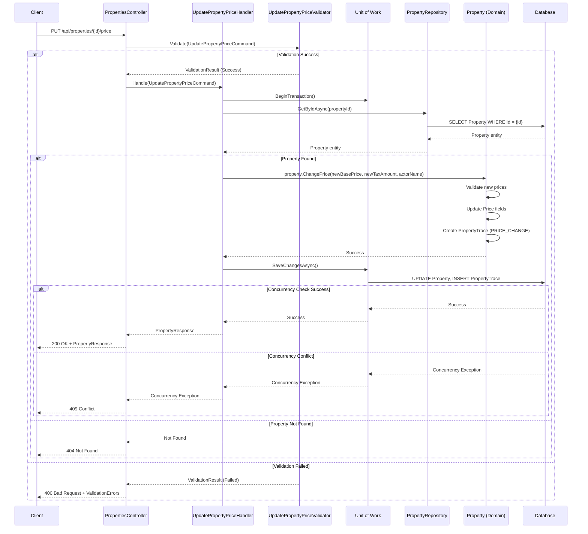
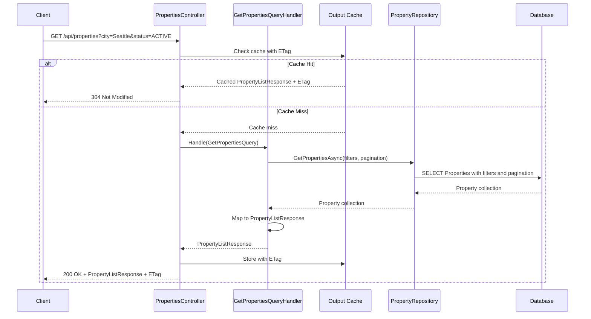
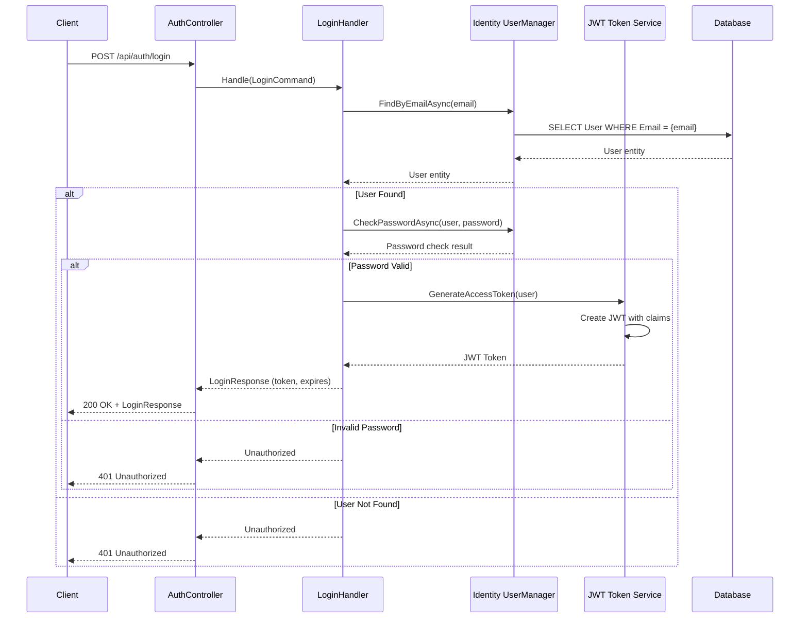
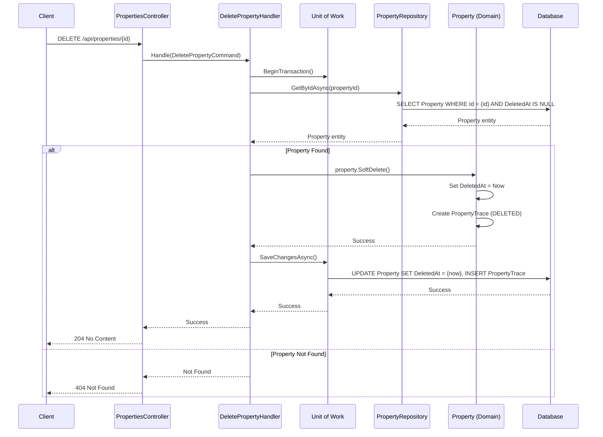

# Sequence Diagrams

This document contains sequence diagrams for the most important operations in the RealEstate application, showing the flow of data and control through the different layers of the Clean Architecture.

## Property Creation Flow

This diagram shows how a new property is created, following the CQRS pattern and domain-driven design principles.

## Property Price Update Flow

This diagram shows the property price update operation, which includes audit trail creation and optimistic concurrency control.

## Property Query with Filtering

This diagram shows how property queries work with filtering, pagination, and caching.

## JWT Authentication Flow

This diagram shows the JWT authentication process used throughout the API.

## Soft Delete Operation

This diagram shows how soft delete operations work while maintaining referential integrity.

## Key Patterns Illustrated

### CQRS Light Pattern
- **Commands** flow through validation → handler → domain → repository
- **Queries** go directly from handler → repository, bypassing domain logic
- **Separation** of read and write operations with different optimization strategies

### Domain-Driven Design
- **Rich Domain Models** contain business logic and validation
- **Factory Methods** ensure proper entity creation
- **Domain Events** (traces) are created automatically during state changes

### Clean Architecture
- **Dependency Flow** always points inward toward the domain
- **Controllers** orchestrate but contain no business logic
- **Handlers** coordinate between layers without business rules

### Audit and Concurrency
- **Automatic Audit Trails** created for all significant operations
- **Optimistic Concurrency** using RowVersion for conflict detection
- **Soft Deletes** maintain data integrity and audit history

### Performance Optimizations
- **Output Caching** with ETag support for conditional requests
- **Query Optimization** with proper filtering at the database level
- **Transaction Management** ensures data consistency