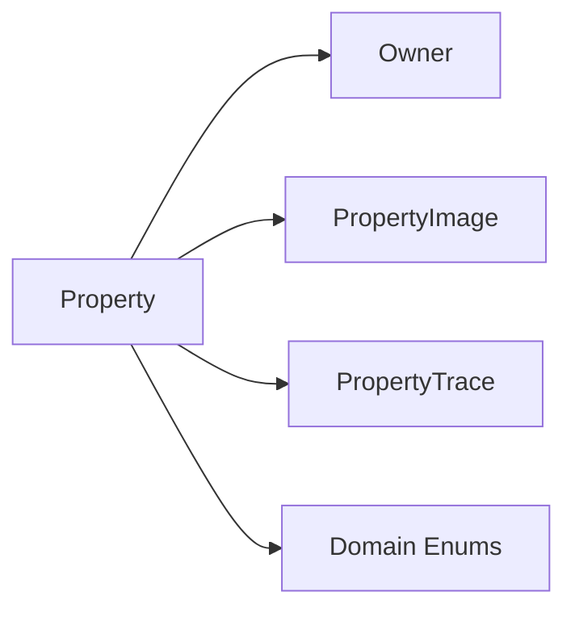
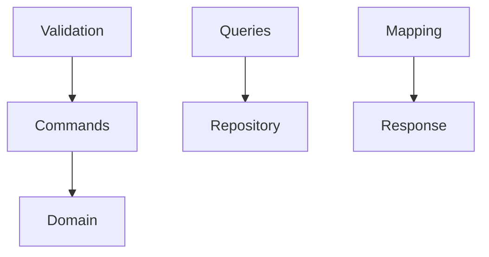
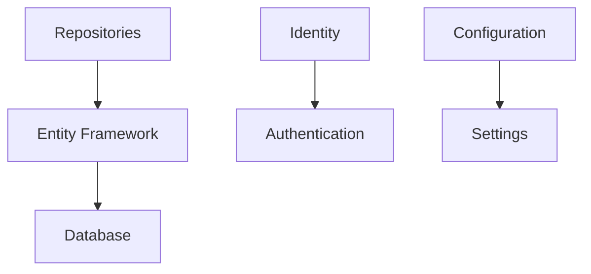

# Architecture Overview

The RealEstate application follows Clean Architecture principles combined with Domain-Driven Design (DDD) patterns to create a maintainable, testable, and scalable real estate management system.

## Architecture Principles

### Clean Architecture
The application is structured in concentric circles where dependencies point inward toward the core domain:

- **Domain Layer** (Core): Contains business entities, value objects, and domain services
- **Application Layer**: Contains use cases, command/query handlers, and application services  
- **Infrastructure Layer**: Contains data access, external services, and framework concerns
- **API Layer**: Contains controllers, middleware, and HTTP-specific logic

### Domain-Driven Design (DDD)
The domain model reflects the real-world business concepts of real estate management:

- **Aggregates**: `Property` and `Owner` serve as consistency boundaries
- **Entities**: Rich domain objects with business behavior and private state
- **Value Objects**: Enums and immutable objects representing domain concepts
- **Domain Services**: Coordinate operations across multiple aggregates

## Technology Stack

### Backend (.NET 8)
- **ASP.NET Core 8.0**: Web API framework with built-in DI and middleware
- **Entity Framework Core**: Modern ORM with SQL Server provider
- **FluentValidation**: Declarative validation rules
- **ASP.NET Core Identity**: Authentication and user management
- **JWT Bearer Authentication**: Stateless API authentication

### Database (SQL Server)
- **SQL Server**: Primary data store with full ACID compliance
- **Entity Framework Migrations**: Database schema versioning
- **Query Filters**: Global soft delete and tenant filtering
- **Optimistic Concurrency**: Row version-based conflict detection

### Patterns and Practices
- **CQRS Light**: Separate command/query handlers without event sourcing
- **Repository Pattern**: Data access abstraction layer
- **Unit of Work**: Transaction boundary management
- **Factory Pattern**: Controlled entity creation with validation
- **Soft Delete**: Audit-friendly data retention strategy

## System Boundaries

### Core Domain
The heart of the system focusing on real estate business logic:

### Application Services
Orchestrate domain operations and external concerns:

### Infrastructure Concerns
Handle technical implementation details:

## Quality Attributes

### Maintainability
- **Separation of Concerns**: Clear layer boundaries and responsibilities
- **Dependency Injection**: Loose coupling and testability
- **Configuration Management**: Environment-specific settings via IOptions
- **Logging and Monitoring**: Comprehensive application insights

### Performance  
- **Output Caching**: ETag-based conditional requests
- **Query Optimization**: Proper indexing and query patterns
- **Connection Pooling**: Efficient database resource utilization
- **Lazy Loading**: On-demand relationship loading

### Security
- **JWT Authentication**: Secure, stateless authentication
- **Input Validation**: Multi-layer validation (model + FluentValidation)
- **SQL Injection Prevention**: Parameterized queries via EF Core
- **CORS Configuration**: Controlled cross-origin access

### Scalability
- **Stateless Design**: Horizontal scaling capability
- **Caching Strategy**: Multiple levels of caching support
- **Database Optimization**: Efficient queries and indexing
- **Async Operations**: Non-blocking I/O throughout the stack

## Development Practices

### Testing Strategy
- **Unit Tests**: Domain logic and business rules (NUnit + FluentAssertions)
- **Integration Tests**: API endpoints and database operations
- **Test Coverage**: Minimum 80% coverage for Application and Domain layers
- **Test Isolation**: Each test manages its own data state

### Code Quality
- **Static Analysis**: Built-in .NET analyzers and linting rules
- **Code Reviews**: Peer review process for all changes
- **Continuous Integration**: Automated build and test pipeline
- **Documentation**: Comprehensive API documentation via OpenAPI

### Deployment
- **Environment Configuration**: Separate settings for Dev/Staging/Prod
- **Database Migrations**: Automated schema deployment
- **Health Checks**: Application and dependency health monitoring
- **Logging**: Structured logging with correlation IDs

This architecture provides a solid foundation for the RealEstate application while maintaining flexibility for future enhancements and scaling requirements.