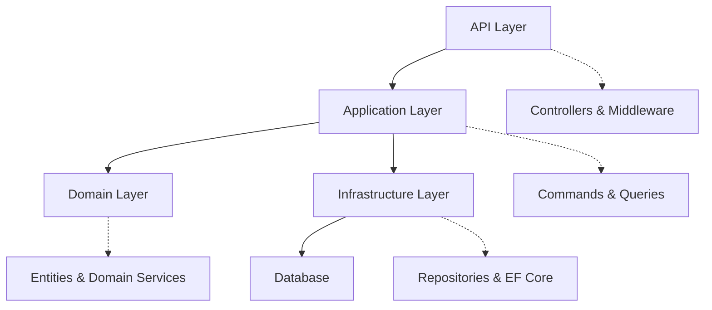

# Introduction

Welcome to the **RealEstate API** documentation! This comprehensive guide covers everything you need to know about our .NET 8 real estate management application.

## What is RealEstate API?

RealEstate API is a modern, scalable real estate management system built using Clean Architecture principles and Domain-Driven Design patterns. It provides a robust foundation for managing properties, owners, and related real estate operations.

## Key Features

- 🏗️ **Clean Architecture** - Clear separation of concerns across Domain, Application, Infrastructure, and API layers
- 🎯 **Domain-Driven Design** - Rich domain models with proper business logic encapsulation
- 🔒 **JWT Authentication** - Secure API access with token-based authentication
- 📊 **Entity Framework Core** - Modern ORM with SQL Server support
- ✅ **Comprehensive Testing** - NUnit tests with FluentAssertions
- 🔍 **FluentValidation** - Robust input validation
- 📝 **OpenAPI Documentation** - Auto-generated API documentation with Swagger
- 🚀 **Output Caching** - ETag-based conditional requests for performance

## Architecture Overview

The application follows a layered architecture approach:

## Quick Start

To get started with the RealEstate API:

1. **[Installation Guide](./getting-started/installation)** - Set up your development environment
2. **[Configuration](./getting-started/configuration)** - Configure database and application settings
3. **[First Run](./getting-started/first-run)** - Run the application for the first time

## Documentation Structure

This documentation is organized into several sections:

- **Getting Started** - Installation, configuration, and first steps
- **Development Guide** - In-depth development information
- **API Documentation** - Complete API reference
- **Architecture** - System design and architectural decisions
- **Database Schema** - Database structure and relationships
- **ADRs** - Architecture Decision Records

## Need Help?

If you have questions or need support:

- Check our [API Reference](/api-reference) for endpoint documentation
- Review [Architecture Decision Records](/adrs) for design rationale
- Explore the [Database Schema](/database) for data structure details

Let's get started! 🚀